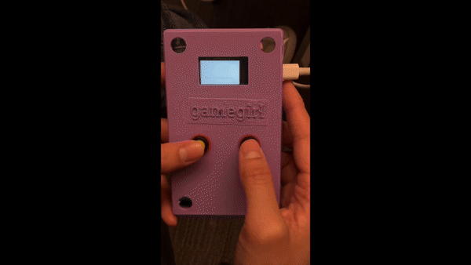

# Typing Game on Gamegirl

Welcome to our multi-player game designed specifically for embedded devices! The objective is straightforward yet competitive: outpace your opponent and win the race. Inspired by [Nitro-Type](https://www.nitrotype.com), our game focuses on generating commands like **"Left"** or **"Right"**. Players compete to hit the correct buttons for the commands as quickly and accurately as possible. The player who successfully fills up their progress bar first wins the game! 

### Authors: 
Aliya Tang and Mila Lin Tabach 
### Hardware Components: 
- 4 buttons (2 buttons for each Gamegirl enclosure)
- USB-C cables
- Female to Male Jumper Wires

  

## Demo
!
!

## Overview
Our code sets up a multiplayer game using ESP-NOW with a TFT display on ESP32. The game revolves around pressing buttons (left and right) to match randomly generated commands like "Left" or "Right." Players compete to reach a progress goal (30) first. If either player reaches a specific threshold (28 or more), they win and is shown a “Success” message while the other is shown a "Failed" message. The codebase includes different components including ESP-NOW communication, progress bar, and the gaming logic. 

### Libraries to Download:
- TFT_eSPI 
- SPI
- esp_now
- WiFi

### How to download libraries:

1. Open Arduino IDE
2. Click Tools > Manage Libraries
3. Search for the specific librariy and click install

### Acknowledgements:

Thank you so much to our wonderful professor Professor Tseng and our amazing TA Claudia for helping us put the project together. We would also like to thank our classmates for the amazing input AND we would like to thank each other for being the best teammate ever! <3

